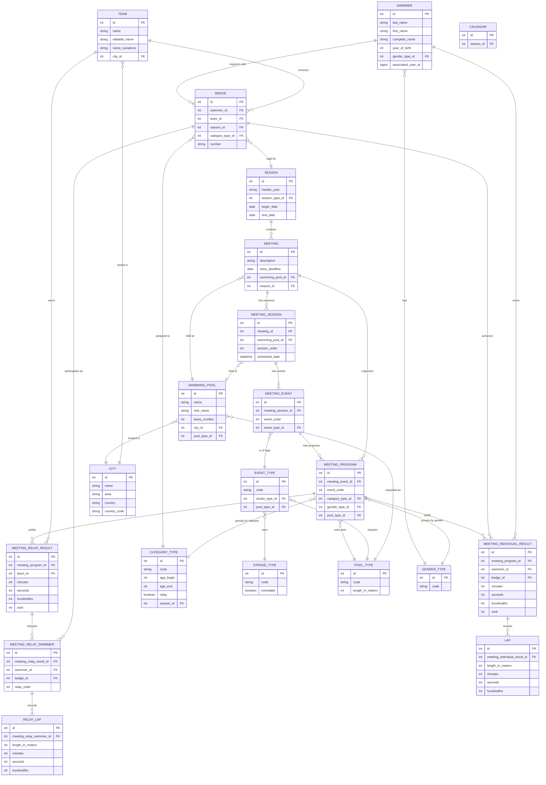

# Goggles Database Entity-Relationship Documentation

## Overview

The Goggles framework is designed as a data aggregator for Master's Swimmers Championship competition results. This document describes the entity-relationship structure of the database that powers the Goggles ecosystem.

The Goggles database is implemented as a Rails Engine gem (`goggles_db`) that serves as a dependency for the following components:
- `goggles_main`: The front-end client application (read-only)
- `goggles_api`: The API backend (read-write)
- `goggles_admin2`: The admin interface (read-write)

## Core Entity Groups

The database schema can be logically divided into the following entity groups:

### 1. Participants
Entities that represent the people and organizations participating in competitions:
- Swimmers
- Teams
- Badges (season-specific registrations of swimmers with teams)

### 2. Competition Structure
Entities that organize the hierarchy of competitions:
- Seasons (championship years)
- Calendars (collection of meetings within a season)
- Meetings (competitions)
- Meeting Sessions
- Meeting Events
- Meeting Programs (event divisions by category and gender)

### 3. Results
Entities that store competition outcomes:
- Meeting Individual Results
- Meeting Relay Results
- Laps (split times for individual events)
- Relay Laps (split times for relay phases)

### 4. Classification
Entities that define categories and types:
- Category Types (age groups)
- Gender Types
- Event Types (stroke + distance)
- Stroke Types

### 5. Venues
Entities related to competition locations:
- Swimming Pools
- Cities

## Key Relationships

1. **Swimmer to Team**: Swimmers affiliate with Teams through Badges for specific Seasons
2. **Season to Meeting**: Seasons contain Meetings organized through Calendars
3. **Meeting to Result**: Meetings contain Sessions, Events, and Programs that lead to Individual and Relay Results
4. **Result to Lap**: Individual Results have Laps, while Relay Results have Relay Swimmers with Relay Laps

## Entity-Relationship Diagram

## Key Database Tables and Their Purposes

### Participant Tables

| Table | Purpose |
|-------|---------|
| `swimmers` | Stores information about individual athletes |
| `teams` | Contains swimming clubs/organizations |
| `badges` | Links swimmers to teams for specific seasons |

### Competition Structure Tables

| Table | Purpose |
|-------|---------|
| `seasons` | Defines championship years (typically Sep-Aug) |
| `calendars` | Organizes meetings within seasons |
| `meetings` | Stores swimming competitions |
| `meeting_sessions` | Divides meetings into time blocks |
| `meeting_events` | Lists events within sessions |
| `meeting_programs` | Defines event details by category and gender |

### Result Tables

| Table | Purpose |
|-------|---------|
| `meeting_individual_results` | Individual swimmer results |
| `meeting_relay_results` | Team relay results |
| `laps` | Split times for individual events |
| `relay_laps` | Split times for relay phases |
| `meeting_relay_swimmers` | Swimmers participating in relays |

### Classification Tables

| Table | Purpose |
|-------|---------|
| `category_types` | Age categories for competition grouping |
| `gender_types` | Gender divisions |
| `event_types` | Swimming event definitions |
| `stroke_types` | Swimming stroke definitions |
| `pool_types` | Pool specifications |

### Venue Tables

| Table | Purpose |
|-------|---------|
| `swimming_pools` | Competition venues |
| `cities` | Locations for teams and venues |

## Database Features

1. **Indexing Strategy**: Heavy use of indexes for performance optimization, including fulltext indexes for name searching
2. **Unique Constraints**: Enforced unique combinations (e.g., team_id + season_id in team_affiliations)
3. **Foreign Keys**: Relationships between tables are supported by foreign key constraints
4. **Metadata Fields**: Common fields like lock_version, created_at, updated_at
5. **Multi-language Support**: UTF-8 character sets for international data

## Data Flow

1. **Data Import**: Competition results are imported via the admin interface
2. **Data Review**: Imported data undergoes manual review and correction
3. **Data Access**: The read-only client accesses the verified data
4. **Data Synchronization**: The API facilitates data exchange between components

This documentation provides a comprehensive overview of the Goggles database structure, which is designed to efficiently store and organize swimming competition results for Master's Swimmers.